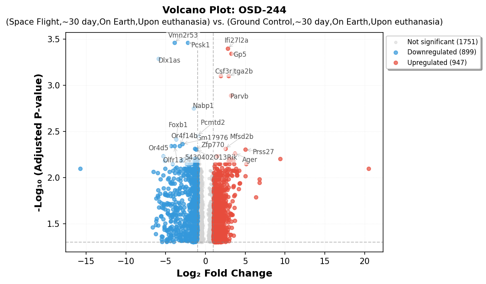
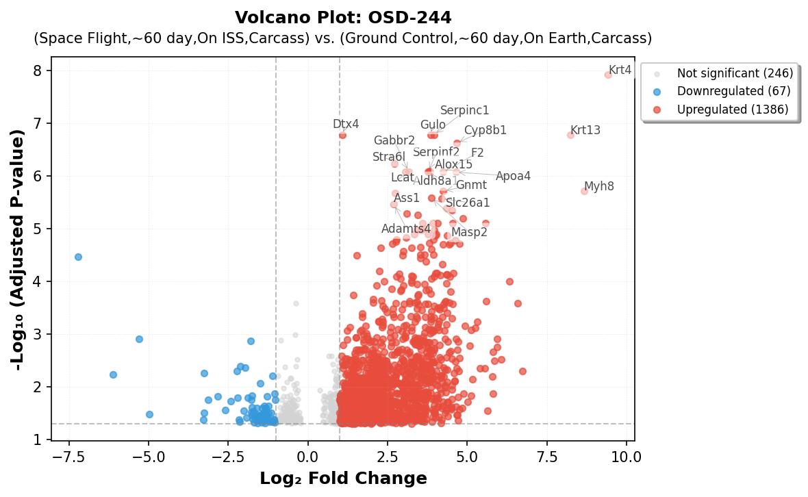
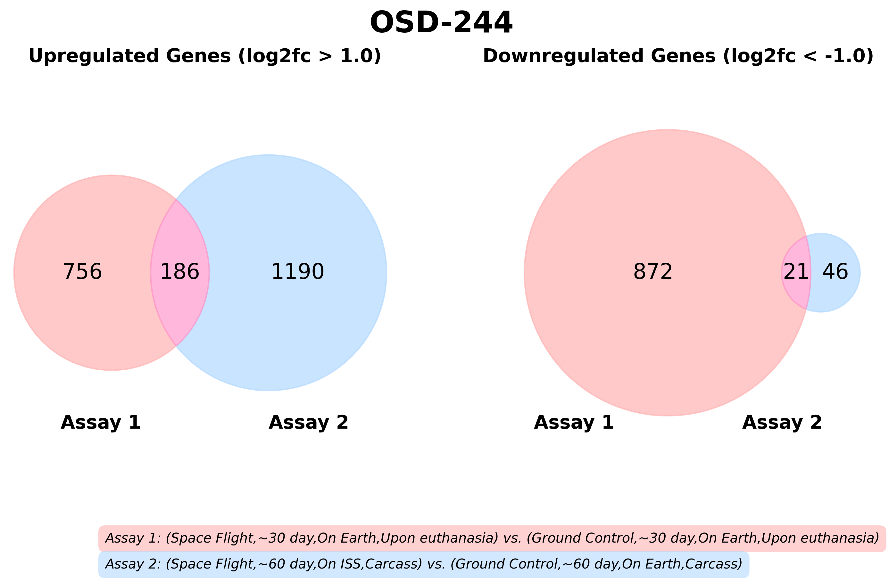
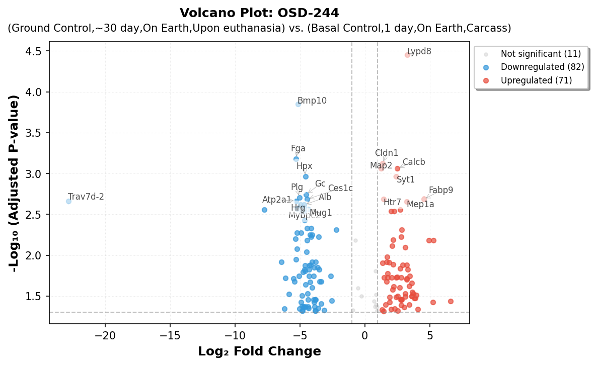

# Analysis of GeneLab Assays using MCP Tools

This example chat run in Claude Desktop demonstrates the use of MCP tools to analyse differential expression data from the `spoke-genelab` KG

Legend:

`Text in a gray box is a user prompt`

> Text in block quotes shows the tool selected by the MCP service for the GeneLab (G) knowledge graph.

Images are shown inline here. In the actual chat, the images are not shown inline, but saved in the `Downloads` folder.

-----
&nbsp;
&nbsp;

`Select assays for OSD-244`

I'll help you select an assay for study OSD-244. Let me retrieve the available assays and their experimental factors.

> G  Select assay

## **Factor arrays across all assays for study: OSD-244**

Choose an EVEN number of indices for pairwise comparisons, e.g., '1,2,3,4' creates pairs (1 vs 2\) and (3 vs 4):

| Index | Factors |
| ----- | ----- |
| 1 | Basal Control, 1 day, On Earth, Carcass |
| 2 | Basal Control, 1 day, On Earth, Upon euthanasia |
| 3 | Ground Control, \~30 day, On Earth, Upon euthanasia |
| 4 | Ground Control, \~60 day, On Earth, Carcass |
| 5 | Space Flight, \~30 day, On Earth, Upon euthanasia |
| 6 | Space Flight, \~60 day, On ISS, Carcass |

Please select an even number of indices to create pairwise comparisons. For example:

* To compare Space Flight (\~30 day) vs Ground Control (\~30 day): select 5,3  
* To compare Space Flight (\~60 day) vs Ground Control (\~60 day): select 6,4  
* To compare both timepoints: select 5,3,6,4

What comparison(s) would you like to make?  

`5,3,6,4`

> G  Select assay

## **Selected Assays for OSD-244**

### **Pair 1: Space Flight vs Ground Control (\~30 day)**

* Condition 1: Space Flight, \~30 day, On Earth, Upon euthanasia  
* Condition 2: Ground Control, \~30 day, On Earth, Upon euthanasia  
* Assay ID: OSD-244-1609181c8f85ad2812be0c2c89cd2a4d

### **Pair 2: Space Flight vs Ground Control (\~60 day)**

* Condition 1: Space Flight, \~60 day, On ISS, Carcass  
* Condition 2: Ground Control, \~60 day, On Earth, Carcass  
* Assay ID: OSD-244-b9c762e0be0e81f9db1f8d9a78a61b21

---

## **Suggested Next Steps:**

1. Find differentially expressed genes for each comparison  
2. Create volcano plots for individual comparisons  
3. Identify common genes that show consistent changes across both timepoints  
4. Create Venn diagrams to visualize gene overlap between the two comparisons

Would you like me to proceed with any of these analyses? 

`1` 

I'll find the differentially expressed genes for both comparisons. 

> G  Find differentially expressed genes  
> G  Find differentially expressed genes

# **Differentially Expressed Genes for OSD-244**

## **Comparison 1: Space Flight vs Ground Control (\~30 day)**

Assay ID: OSD-244-1609181c8f85ad2812be0c2c89cd2a4d

### **Top 10 Upregulated Genes**

| Gene Symbol | Log2 Fold Change | Adjusted P-value |
| ----- | ----- | ----- |
| Trav7d-2 | 20.53 | 0.0080 |
| Sftpc | 9.37 | 0.0063 |
| Cldn18 | 6.77 | 0.0114 |
| Sftpb | 6.77 | 0.0104 |
| Cxcl15 | 6.35 | 0.0163 |
| Slc34a2 | 5.13 | 0.0071 |
| Prss27 | 5.01 | 0.0050 |
| Dbh | 4.99 | 0.0096 |
| Ly6g6c | 4.34 | 0.0115 |
| Lamp3 | 4.29 | 0.0116 |

### **Top 10 Downregulated Genes**

| Gene Symbol | Log2 Fold Change | Adjusted P-value |
| ----- | ----- | ----- |
| Cnfn | \-15.76 | 0.0080 |
| Cldn34c6 | \-6.64 | 0.0348 |
| Gpr101 | \-6.54 | 0.0086 |
| Vmn1r28 | \-6.27 | 0.0328 |
| Vmn2r94 | \-6.25 | 0.0409 |
| Gm14052 | \-6.20 | 0.0296 |
| A630073D07Rik | \-6.19 | 0.0168 |
| Olfr1489 | \-6.13 | 0.0279 |
| Vmn2r66 | \-6.01 | 0.0089 |
| Olfr613 | \-6.00 | 0.0157 |

---

## **Comparison 2: Space Flight vs Ground Control (\~60 day)**

Assay ID: OSD-244-b9c762e0be0e81f9db1f8d9a78a61b21

### **Top 10 Upregulated Genes**

| Gene Symbol | Log2 Fold Change | Adjusted P-value |
| ----- | ----- | ----- |
| Krt4 | 9.43 | 1.20e-08 |
| Myh8 | 8.66 | 1.93e-06 |
| Krt13 | 8.25 | 1.66e-07 |
| Klk11 | 6.74 | 0.0051 |
| Cfap97d2 | 6.59 | 0.0003 |
| Bpifa1 | 6.32 | 0.0001 |
| Bpifb1 | 6.07 | 0.0030 |
| Gm36041 | 5.95 | 0.0018 |
| Scgb3a1 | 5.94 | 0.0012 |
| C730027H18Rik | 5.84 | 0.0033 |

### **Top 10 Downregulated Genes**

| Gene Symbol | Log2 Fold Change | Adjusted P-value |
| ----- | ----- | ----- |
| Ibsp | \-7.21 | 3.48e-05 |
| Gm25682 | \-6.12 | 0.0059 |
| Gm23686 | \-5.31 | 0.0012 |
| Gm25189 | \-4.98 | 0.0336 |
| Gm23511 | \-3.28 | 0.0427 |
| Dynlt2a3 | \-3.27 | 0.0316 |
| Kcnh7 | \-3.25 | 0.0055 |
| Tnn | \-3.13 | 0.0177 |
| Bglap | \-2.83 | 0.0153 |
| Tnni1 | \-2.60 | 0.0277 |

---

Would you like me to find common genes between these two comparisons, create volcano plots, or perform additional analyses?

`Volcano plots`

I'll create volcano plots for both comparisons.  

> G  Create volcano plot  
> G  Create volcano plot

# **Volcano Plots Generated**

## **Comparison 1: Space Flight vs Ground Control (\~30 day)**

Factors: Space Flight, \~30 day, On Earth, Upon euthanasia vs. Ground Control, \~30 day, On Earth, Upon euthanasia  
Results:

* Total genes analyzed: 3,597  
* Significantly upregulated: 947 (26.3%)  
* Significantly downregulated: 899 (25.0%)  
* Not significant: 1,751 (48.7%)

---

## **Comparison 2: Space Flight vs Ground Control (\~60 day)**

Factors: Space Flight, \~60 day, On ISS, Carcass vs. Ground Control, \~60 day, On Earth, Carcass  
Results:

* Total genes analyzed: 1,699  
* Significantly upregulated: 1,386 (81.6%)  
* Significantly downregulated: 67 (3.9%)  
* Not significant: 246 (14.5%)

---

## **Key Observations:**

The 60-day comparison shows a much more dramatic upregulation pattern (81.6% upregulated) compared to the 30-day comparison (26.3% upregulated), suggesting that longer duration spaceflight has a more pronounced effect on gene expression. The 30-day comparison shows a more balanced response between up- and down-regulation.  
Would you like me to create Venn diagrams to visualize the overlap between these two comparisons, or identify the common differentially expressed genes?

`Identify the common differentially expressed genes`

I'll identify the common differentially expressed genes between the two comparisons.  

> G  Find common differentially expressed genes

# **Common Differentially Expressed Genes**

Log2FC Threshold: ±1.0 (≥2.0-fold change)

## **Summary**

* Common upregulated genes: 186  
* Common downregulated genes: 21

This reveals a strong trend toward upregulation during spaceflight at both timepoints, with relatively few genes being consistently downregulated.  
---

## **Top 20 Common Upregulated Genes (by average log2FC)**

| Gene | 30-day log2FC | 60-day log2FC | Average | Function/Category |
| ----- | ----- | ----- | ----- | ----- |
| Sim2 | 3.527 | 5.596 | 4.562 | Transcription factor |
| Ly6g6c | 4.339 | 4.578 | 4.459 | Immune response |
| Agt | 3.849 | 4.440 | 4.145 | Angiotensinogen, blood pressure |
| Ceacam19 | 3.299 | 4.075 | 3.687 | Cell adhesion molecule |
| Hmga1b | 3.219 | 3.869 | 3.544 | Chromatin remodeling |
| F10 | 3.500 | 3.806 | 3.653 | Coagulation factor X |
| Ahsg | 3.185 | 3.555 | 3.370 | Alpha-2-HS-glycoprotein |
| F7 | 3.371 | 3.399 | 3.385 | Coagulation factor VII |
| Clca1 | 3.388 | 3.529 | 3.459 | Calcium-activated chloride channel |
| Prg4 | 2.460 | 3.434 | 3.447 | Proteoglycan 4, lubrication |
| Igkv17-121 | 2.439 | 3.523 | 2.981 | Immunoglobulin kappa variable |
| Gsc | 2.881 | 3.262 | 3.072 | Goosecoid homeobox |
| Prkag3 | 3.066 | 3.112 | 3.089 | Energy sensing, metabolism |
| Saa3 | 2.274 | 3.191 | 2.733 | Serum amyloid A3, inflammation |
| C4b | 2.720 | 3.017 | 2.869 | Complement component 4B |
| F5 | 2.858 | 3.009 | 2.934 | Coagulation factor V |
| Hamp | 3.174 | 2.849 | 3.012 | Hepcidin, iron regulation |
| Asb5 | 3.013 | 2.975 | 2.994 | Ankyrin repeat protein |
| Crb2 | 2.953 | 2.135 | 2.544 | Cell polarity protein |
| Rarres2 | 2.848 | 2.086 | 2.467 | Chemerin, adipokine |

---

## **All Common Downregulated Genes**

| Gene | 30-day log2FC | 60-day log2FC | Average |
| ----- | ----- | ----- | ----- |
| Kcnh7 | \-2.546 | \-3.254 | \-2.900 |
| Gm33619 | \-2.112 | \-1.729 | \-1.921 |
| Gm12238 | \-2.114 | \-1.316 | \-1.715 |
| LOC115487699 | \-2.102 | \-1.973 | \-2.038 |
| Rnu12 | \-1.886 | \-1.612 | \-1.749 |
| Itm2a | \-1.882 | \-1.159 | \-1.521 |
| 2310015K22Rik | \-1.862 | \-1.752 | \-1.807 |
| Gm22488 | \-1.844 | \-1.702 | \-1.773 |
| Snora36b | \-1.816 | \-1.576 | \-1.696 |
| Gm25313 | \-1.750 | \-1.633 | \-1.692 |
| Nebl | \-1.722 | \-1.229 | \-1.476 |
| Gm39792 | \-1.712 | \-1.407 | \-1.560 |
| Trbv23 | \-1.669 | \-1.474 | \-1.572 |
| Gm26130 | \-1.611 | \-1.417 | \-1.514 |
| Lpar6 | \-1.470 | \-1.048 | \-1.259 |
| Snora23 | \-1.442 | \-1.333 | \-1.388 |
| Gm22620 | \-1.397 | \-1.378 | \-1.388 |
| Snora81 | \-1.380 | \-1.147 | \-1.264 |
| Gm25099 | \-1.363 | \-1.354 | \-1.359 |
| LOC115489609 | \-1.917 | \-1.584 | \-1.751 |
| Ccne2 | \-1.268 | \-1.115 | \-1.192 |

---

## **Key Biological Themes**

Upregulated:

* Coagulation factors (F10, F7, F5): Increased blood clotting potential  
* Immune response (Ly6g6c, complement proteins, immunoglobulins): Enhanced immune activation  
* Vascular/endothelial (VEGF pathway genes, adhesion molecules): Vascular remodeling  
* Metabolic regulation (Agt, Prkag3, Hmgcs2): Altered energy and fluid homeostasis  
* Inflammation (Saa3, chemokines, cytokine receptors): Inflammatory response

Downregulated:

* Mostly uncharacterized genes (Gm genes) and non-coding RNAs  
* Kcnh7: Potassium channel (most significantly downregulated)

Would you like me to create Venn diagrams to visualize this overlap, or perform any additional analyses?  

`Create a venn diagram` 

I'll create Venn diagrams comparing the differentially expressed genes between the two comparisons.  

> G  Create venn diagram

# **Venn Diagram Generated**

  
---

## **Overlap Analysis**

### **Upregulated Genes (log2fc \> 1.0)**

| Category | Count | Percentage |
| ----- | ----- | ----- |
| 30-day only | 756 | 80.3% of 30-day |
| 60-day only | 1,190 | 86.5% of 60-day |
| Common to both | 186 | 19.7% of 30-day, 13.5% of 60-day |
| Total (30-day) | 942 |  |
| Total (60-day) | 1,376 |  |

### **Downregulated Genes (log2fc \< \-1.0)**

| Category | Count | Percentage |
| ----- | ----- | ----- |
| 30-day only | 872 | 97.6% of 30-day |
| 60-day only | 46 | 68.7% of 60-day |
| Common to both | 21 | 2.4% of 30-day, 31.3% of 60-day |
| Total (30-day) | 893 |  |
| Total (60-day) | 67 |  |

---

## **Key Insights**

1. Limited overlap in upregulated genes: Only 186 genes (13.5-19.7%) are commonly upregulated, suggesting that the 30-day and 60-day spaceflight exposures trigger largely distinct transcriptional responses.  
2. Duration-specific effects: The 60-day exposure shows dramatically more upregulated genes (1,376 vs 942), with 1,190 being unique to the longer duration.  
3. Downregulation patterns differ: The 30-day exposure shows extensive downregulation (893 genes), while 60-day shows minimal downregulation (67 genes), with only 21 genes commonly downregulated.  
4. Core spaceflight response: The 186 commonly upregulated genes likely represent the core transcriptional response to spaceflight, regardless of duration, including key pathways like coagulation, immune response, and vascular remodeling.

Would you like me to perform any additional analyses on these results?  

`3,1`

I'll create a comparison between the Basal Control conditions (indices 3 and 1). 

> G  Select assay

## **Selected Assay for OSD-244**

### **Comparison: Ground Control (\~30 day) vs Basal Control (1 day)**

* Condition 1: Ground Control, \~30 day, On Earth, Upon euthanasia  
* Condition 2: Basal Control, 1 day, On Earth, Carcass  
* Assay ID: OSD-244-b3e374ff70a9a2d124a20fd71f9c7eb1

This comparison will show gene expression changes that occur over \~30 days in ground control conditions (essentially time/age effects rather than spaceflight effects).  
---

Would you like me to:

1. Find differentially expressed genes for this comparison  
2. Create a volcano plot  
3. Both

`3` 

I'll perform both analyses \- finding differentially expressed genes and creating a volcano plot for the Ground Control (\~30 day) vs Basal Control (1 day) comparison.

> G  Find differentially expressed genes  
> G  Create volcano plot

# **Ground Control (\~30 day) vs Basal Control (1 day) Analysis**

## **Differentially Expressed Genes**

### **Top 10 Upregulated Genes**

| Gene Symbol | Log2 Fold Change | Adjusted P-value | Potential Function |
| ----- | ----- | ----- | ----- |
| A630073D07Rik | 6.63 | 0.0365 | Uncharacterized |
| Wif1 | 5.29 | 0.0066 | Wnt inhibitory factor |
| Ibsp | 5.23 | 0.0375 | Bone sialoprotein |
| Col10a1 | 4.95 | 0.0066 | Collagen type X |
| Fabp9 | 4.53 | 0.0021 | Fatty acid binding protein |
| Chst5 | 4.08 | 0.0457 | Carbohydrate sulfotransferase |
| Col2a1 | 3.98 | 0.0307 | Collagen type II |
| Reg1 | 3.89 | 0.0337 | Regenerating islet-derived protein |
| Iapp | 3.83 | 0.0337 | Islet amyloid polypeptide |
| Ucma | 3.72 | 0.0296 | Unique cartilage matrix-associated protein |

### **Top 10 Downregulated Genes**

| Gene Symbol | Log2 Fold Change | Adjusted P-value | Potential Function |
| ----- | ----- | ----- | ----- |
| Trav7d-2 | \-22.85 | 0.0022 | T cell receptor alpha variable |
| Nppb | \-7.75 | 0.0028 | Natriuretic peptide B |
| Cyp2c54 | \-6.43 | 0.0121 | Cytochrome P450 |
| Nppa | \-6.19 | 0.0451 | Natriuretic peptide A |
| Myh8 | \-6.12 | 0.0190 | Myosin heavy chain 8 |
| Nctc1 | \-5.86 | 0.0301 | C-type lectin |
| Gm8424 | \-5.48 | 0.0194 | Predicted gene |
| Apcs | \-5.40 | 0.0210 | Serum amyloid P-component |
| Tnnc2 | \-5.34 | 0.0063 | Troponin C2, fast skeletal |
| Cyp2b9 | \-5.32 | 0.0114 | Cytochrome P450 |

---

## **Volcano Plot Results**

---

Summary Statistics:

* Total genes analyzed: 164  
* Significantly upregulated: 71 (43.3%)  
* Significantly downregulated: 82 (50.0%)  
* Not significant: 11 (6.7%)

---

## **Key Biological Insights**

This comparison reveals developmental/maturation changes over \~30 days in ground control conditions:  
Upregulated (maturation markers):

* Bone/cartilage development: Ibsp, Col10a1, Col2a1, Ucma \- indicates skeletal maturation  
* Metabolic changes: Fabp9, Iapp, Reg1 \- pancreatic and metabolic maturation  
* Wnt signaling: Wif1 \- developmental pathway regulation

Downregulated (early life markers):

* Cardiac natriuretic peptides: Nppb, Nppa \- reduced cardiac stress signaling  
* Muscle development: Myh8, Tnnc2 \- transition from neonatal to adult muscle isoforms  
* T cell receptor: Trav7d-2 \- immune system changes  
* Metabolic enzymes: Cyp2c54, Cyp2b9 \- developmental shifts in drug metabolism

This represents normal developmental transitions from neonatal (1 day) to juvenile (\~30 day) stages.  
Would you like me to compare this with the spaceflight data or perform additional analyses?  
  
Summary Statistics:

* Total genes analyzed: 164  
* Significantly upregulated: 71 (43.3%)  
* Significantly downregulated: 82 (50.0%)  
* Not significant: 11 (6.7%)

