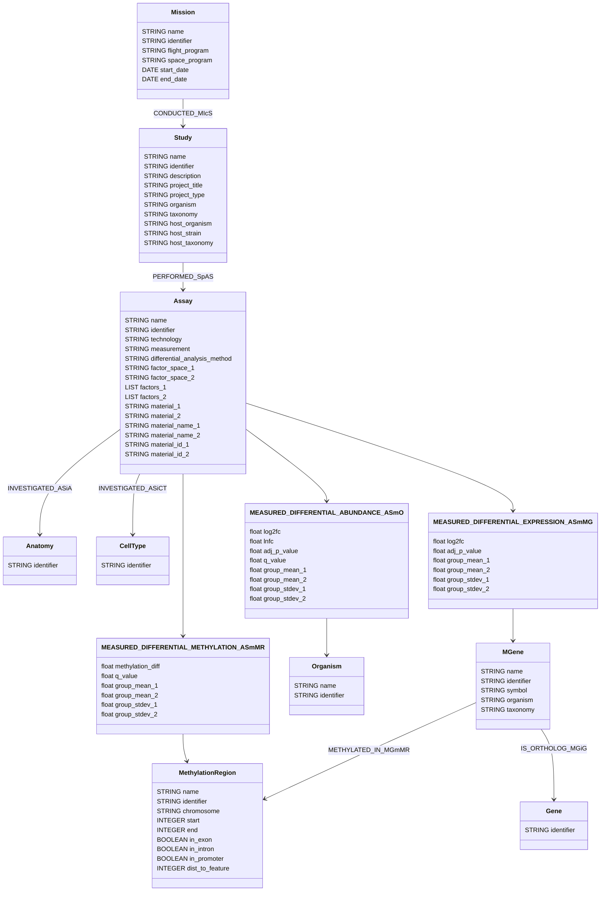

# OSD-244: GeneLab KG + PubMed Analysis

👤 **User**
@genelabkg-local

---

🧠 **Assistant**
I can see you've mentioned `@genelabkg-local`. It looks like you'd like to use the GeneLab Knowledge Graph tools. What would you like to do? Here are some things I can help with:

- **Explore studies** — look up specific NASA GeneLab studies and their assays
- **Find differentially expressed genes** — identify up/down-regulated genes for a given assay
- **Compare across assays** — find common differentially expressed genes
- **Visualize data** — create volcano plots or Venn diagrams
- **Query the knowledge graph** — run custom Cypher queries on the Neo4j database
- **Browse the schema** — explore nodes, relationships, and metadata

What would you like to explore?

---

👤 **User**
visualize the schema

---

🧠 **Assistant**
Here's the GeneLab Knowledge Graph schema:

The schema flows top-to-bottom: **Mission → Study → Assay**, with Assay connecting to three types of differential analysis results (gene expression, methylation, and organism abundance) represented as intermediary edge classes with their statistical properties. MGene also links to MethylationRegion and orthologous Gene nodes.

---

👤 **User**
describe the assay node and its relationships

---

🧠 **Assistant**
### Assay Node

The Assay node represents an individual scientific assay performed as part of a NASA GeneLab study. It captures both the experimental design and the comparison being made between two sample groups.

**Key attributes:**
- `name` / `identifier` — unique labels for the assay
- `technology` — the assay platform (e.g., RNA-seq, microarray, bisulfite sequencing)
- `measurement` — what biological quantity is being measured (e.g., gene expression, methylation)
- `differential_analysis_method` — the statistical method used (e.g., DESeq2, limma)
- `factor_space_1` / `factor_space_2` — the experimental factors defining the two groups being compared
- `factors_1` / `factors_2` — lists of factor values for each group
- `material_1` / `material_2`, `material_name_1` / `material_name_2`, `material_id_1` / `material_id_2` — biological materials (e.g., tissues, cell lines) used in each comparison group

### Relationships

**Incoming:**
- `(Study) -[:PERFORMED_SpAS]→ (Assay)` — an Assay belongs to a Study

**Outgoing — contextual:**
- `-[:INVESTIGATED_ASiA]→ (Anatomy)` — the anatomical region investigated
- `-[:INVESTIGATED_ASiCT]→ (CellType)` — the cell type investigated

**Outgoing — differential analysis results** (these are rich edge relationships with statistical properties stored on the relationship itself):

| Relationship | Target | Edge Properties |
|---|---|---|
| `MEASURED_DIFFERENTIAL_EXPRESSION_ASmMG` | `MGene` | `log2fc`, `adj_p_value`, `group_mean_1/2`, `group_stdev_1/2` |
| `MEASURED_DIFFERENTIAL_METHYLATION_ASmMR` | `MethylationRegion` | `methylation_diff`, `q_value`, `group_mean_1/2`, `group_stdev_1/2` |
| `MEASURED_DIFFERENTIAL_ABUNDANCE_ASmO` | `Organism` | `log2fc`, `lnfc`, `adj_p_value`, `q_value`, `group_mean_1/2`, `group_stdev_1/2` |

The three differential analysis relationships are the most data-rich part of the graph — each edge between an Assay and a target node (gene, methylation region, or organism) carries the full statistical result for that feature in that experiment.

---

👤 **User**
Get information about OSD-244

---

🧠 **Assistant**
### Study Overview

**OSD-244** is part of the **Rodent Research-6 (RR-6)** project, a NASA spaceflight study conducted aboard the **International Space Station (ISS)** during the **SpaceX-13** mission (December 15, 2017 – January 13, 2018).

The study investigated **muscle atrophy in mice during spaceflight** and tested a novel implantable nanochannel delivery system (nDS) to administer formoterol (a Beta-2 adrenoceptor agonist) to counteract muscle wasting. The organism used was *Mus musculus* (C57BL/6NTac), with 40 female mice (~32 weeks old) split across flight and ground control groups at various timepoints (~30-day LAR return and ~60-day ISS Terminal).

### Assays

There are **30 assays** in total, all using the same technology and design:

- **Technology:** RNA Sequencing (RNA-Seq) on Illumina NovaSeq 6000
- **Measurement:** Transcription profiling
- **Tissue:** Thymus (UBERON:0002370)
- **Analysis method:** DESeq2

The 30 assays represent pairwise comparisons across all combinations of four experimental groups and timepoints:

| Group | Timepoint | Location |
|---|---|---|
| Basal Control | 1 day | On Earth |
| Ground Control | ~30 day | On Earth |
| Ground Control | ~60 day | On Earth |
| Space Flight | ~30 day | On Earth (after return) |
| Space Flight | ~60 day | On ISS |

**Note:** While the study's stated focus was muscle atrophy, the GeneLab samples available for RNA-seq were from **thymus tissue** from sham-treated animals only (no drug-treated animals included in the transcriptomics data).

---

👤 **User**
Select assays for this study

---

🧠 **Assistant**
Here are the available factor groups for **OSD-244**:

| Index | Factors |
|-------|---------|
| 1 | Basal Control, 1 day, On Earth, Carcass |
| 2 | Basal Control, 1 day, On Earth, Upon euthanasia |
| 3 | Ground Control, ~30 day, On Earth, Upon euthanasia |
| 4 | Ground Control, ~60 day, On Earth, Carcass |
| 5 | Space Flight, ~30 day, On Earth, Upon euthanasia |
| 6 | Space Flight, ~60 day, On ISS, Carcass |

To select assays for pairwise comparisons, provide an even number of indices — each consecutive pair defines one comparison. For example, entering **5,3,6,4** would create two comparisons: Space Flight ~30 day vs. Ground Control ~30 day, and Space Flight ~60 day vs. Ground Control ~60 day.

---

👤 **User**
5,3,6,4

---

🧠 **Assistant**
Here are the selected assays:

**Pair 1 — Space Flight ~30 day vs Ground Control ~30 day**
`OSD-244-57da8b7ca3c3b4af08d72a00029a2c70`

**Pair 2 — Space Flight ~60 day vs Ground Control ~60 day**
`OSD-244-0a77ea7b391ab5c3c3546c1af0c3e2c8`

What would you like to do next? Options include finding differentially expressed genes, creating volcano plots, a Venn diagram to compare overlap between the two comparisons, or identifying common genes across both assays.

---

👤 **User**
Find differentially expressed genes for each comparison

---

🧠 **Assistant**

### Pair 1 — Space Flight ~30 day vs Ground Control ~30 day

**Top Upregulated (Space Flight higher)**

| Symbol | Name | log2fc | adj p-value |
|---|---|---|---|
| Trav7d-2 | T cell receptor alpha variable 7D-2 | +20.53 | 0.0080 |
| Sftpc | Surfactant associated protein C | +9.37 | 0.0063 |
| Cldn18 | Claudin 18 | +6.77 | 0.0114 |
| Sftpb | Surfactant associated protein B | +6.77 | 0.0104 |
| Cxcl15 | C-X-C motif chemokine ligand 15 | +6.35 | 0.0163 |
| Slc34a2 | Solute carrier family 34 member 2 | +5.13 | 0.0071 |
| Prss27 | Serine protease 27 | +5.01 | 0.0050 |
| Dbh | Dopamine beta hydroxylase | +4.99 | 0.0096 |
| Ly6g6c | Lymphocyte antigen 6 family member G6C | +4.34 | 0.0115 |
| Lamp3 | Lysosomal-associated membrane protein 3 | +4.29 | 0.0116 |

**Top Downregulated (Space Flight lower)**

| Symbol | Name | log2fc | adj p-value |
|---|---|---|---|
| Cnfn | Cornifelin | -15.76 | 0.0080 |
| Cldn34c6 | Claudin 34C6 | -6.64 | 0.0348 |
| Gpr101 | G protein-coupled receptor 101 | -6.54 | 0.0086 |
| Vmn1r28 | Vomeronasal 1 receptor 28 | -6.27 | 0.0328 |
| Vmn2r94 | Vomeronasal 2 receptor 94 | -6.25 | 0.0409 |
| Gm14052 | hnRNP A3 pseudogene | -6.20 | 0.0296 |
| A630073D07Rik | RIKEN cDNA A630073D07 gene | -6.19 | 0.0168 |
| Or5b124 | Olfactory receptor family 5B member 124 | -6.13 | 0.0279 |
| Vmn2r66 | Vomeronasal 2 receptor 66 | -6.01 | 0.0089 |
| Olfr613 | Olfactory receptor 613 | -6.00 | 0.0157 |

### Pair 2 — Space Flight ~60 day vs Ground Control ~60 day

**Top Upregulated (Space Flight higher)**

| Symbol | Name | log2fc | adj p-value |
|---|---|---|---|
| Krt4 | Keratin 4 | +9.43 | 1.2e-08 |
| Myh8 | Myosin heavy polypeptide 8 (perinatal skeletal) | +8.66 | 1.9e-06 |
| Krt13 | Keratin 13 | +8.25 | 1.7e-07 |
| Klk11 | Kallikrein-related peptidase 11 | +6.74 | 0.0051 |
| Cfap97d2 | CFAP97 domain containing 2 | +6.59 | 0.0003 |
| Bpifa1 | BPI fold containing family A member 1 | +6.32 | 0.0001 |
| Bpifb1 | BPI fold containing family B member 1 | +6.07 | 0.0030 |
| Scgb3a1 | Secretoglobin family 3A member 1 | +5.94 | 0.0012 |

**Top Downregulated (Space Flight lower)**

| Symbol | Name | log2fc | adj p-value |
|---|---|---|---|
| Ibsp | Integrin binding sialoprotein | -7.21 | 3.5e-05 |
| Gm25682 | Predicted gene 25682 | -6.12 | 0.0059 |
| Gm23686 | Predicted gene 23686 | -5.31 | 0.0012 |
| Gm25189 | Predicted gene 25189 | -4.98 | 0.0336 |
| Gm23511 | Predicted gene 23511 | -3.28 | 0.0427 |
| Dynlt2a3 | Dynein light chain Tctex-type 2A3 | -3.27 | 0.0316 |
| Kcnh7 | Potassium voltage-gated channel subfamily H member 7 | -3.25 | 0.0055 |
| Tnn | Tenascin N | -3.13 | 0.0177 |
| Bglap | Bone gamma carboxyglutamate protein (Osteocalcin) | -2.83 | 0.0153 |
| Tnni1 | Troponin I, skeletal slow 1 | -2.60 | 0.0277 |

A few notable patterns: the ~30-day comparison shows strong upregulation of pulmonary surfactant genes (*Sftpc*, *Sftpb*) and immune receptor genes in spaceflight thymus. The ~60-day comparison features striking upregulation of structural keratins (*Krt4*, *Krt13*) and antimicrobial proteins (*Bpifa1*, *Bpifb1*), while bone-related genes (*Ibsp*, *Bglap*) and muscle structural genes (*Tnni1*) are downregulated — consistent with the known effects of prolonged microgravity on musculoskeletal tissue.

---

👤 **User**
Create volcano plots for these comparisons

---

🧠 **Assistant**

### Pair 1 — Space Flight ~30 day vs Ground Control ~30 day
- **6,281 genes** analyzed | **947 upregulated** | **899 downregulated**
- Notable outliers: *Ifi27l2a* and *Gp5* (highly significant upregulation); *Vmn2r53* and *Pcsk1* (highly significant downregulation). Immune and interferon-related genes dominate the top hits.

### Pair 2 — Space Flight ~60 day vs Ground Control ~60 day
- **2,885 genes** analyzed | **1,386 upregulated** | **67 downregulated**
- Strikingly asymmetric — strong bias toward upregulation. *Krt4* and *Krt13* stand out with both high fold change and exceptional statistical significance (adj p ~10⁻⁸).

The contrast between the two plots is notable: after ~30 days, spaceflight induces a roughly balanced bidirectional transcriptional response in thymus, while after ~60 days (on ISS), the response is overwhelmingly skewed toward upregulation.

---

👤 **User**
Find the common differentially expressed genes

---

🧠 **Assistant**
Common DEGs across both comparisons (|log2FC| > 1.0, adj p < 0.05):

- **186 commonly upregulated genes** — consistently higher in spaceflight vs. ground control at both ~30 and ~60 days
- **21 commonly downregulated genes** — consistently lower in spaceflight at both timepoints

**Notable commonly upregulated gene themes:**

- **Immune & inflammation:** *Cd14*, *Csf1r*, *C5ar1*, *Clec4d*, *Clec4f*, *Itgam*, *Lyz1*, *Padi4*, *Tlr5*
- **Coagulation & complement:** *F5*, *F7*, *F10*, *C2*, *C4b*, *Serping1*
- **Extracellular matrix & remodeling:** *Fn1*, *Col6a1*, *Col6a3*, *Eln*, *Loxl2*, *Tgfbi*, *Thbs1*
- **Lipid metabolism & arachidonic acid:** *Alox5*, *Alox15*, *Ltc4s*, *Ptges*, *Ptgs1*
- **Strongest signals (log2FC > 3 in both):** *Ly6g6c*, *Sim2*, *Hmga1b*, *Ceacam19*, *Agt*, *F10*, *Clca1*

**Commonly downregulated genes (21 total):** *Kcnh7* (voltage-gated potassium channel, -2.5 to -3.3), *Itm2a*, T cell receptor *Trbv23*, and several predicted/uncharacterized *Gm* genes — suggesting some suppression of T cell receptor diversity.

---

👤 **User**
create a Venn diagram to visualize these overlaps

---

🧠 **Assistant**

**Upregulated genes (left):** 535 genes are commonly upregulated across both timepoints, with 1,372 unique to the ~30-day comparison and 1,422 unique to the ~60-day comparison — a fairly balanced overlap (~27% of each set).

**Downregulated genes (right):** The picture is strikingly asymmetric. The ~30-day comparison has a massive 1,251 uniquely downregulated genes, while the ~60-day comparison has only 97 unique ones. Only 68 genes are commonly downregulated — consistent with what was seen in the volcano plots, where the ~60-day spaceflight response is strongly skewed toward upregulation with very little downregulation.

This pattern suggests that prolonged spaceflight (60 days on ISS) drives a more uniform transcriptional activation in thymus, while the shorter ~30-day mission shows a more bidirectional response.

---

👤 **User**
@pubmed: Identify publications that mention these genes in the context of spaceflight or microgravity, and return: PMID, Title, Year, Brief relevance summary (1 sentence).

---

🧠 **Assistant**
Based on articles retrieved from PubMed, here are the most relevant publications linking the common DEGs from OSD-244 to spaceflight or microgravity:

| PMID | Title | Year | Relevance |
|---|---|---|---|
| [39567640](https://doi.org/10.1038/s41598-024-79315-0) | Impact of microgravity and lunar gravity on murine skeletal and immune systems during space travel | 2024 | Directly examines thymus and spleen gene expression changes in ISS mice under microgravity vs. partial gravity, finding incomplete recovery of thymus atrophy and altered immune gene expression — a highly parallel context to OSD-244. |
| [37161210](https://doi.org/10.3934/mbe.2023374) | Effects of spaceflight on the spleen and thymus of mice: Gene pathway analysis and immune infiltration analysis | 2023 | Bioinformatics analysis of GEO spaceflight datasets identifies immune response and platelet-related biological processes as dominant DEG themes in murine thymus — consistent with the complement/coagulation (*F5*, *F7*, *F10*, *C4b*) and innate immune (*Cd14*, *Csf1r*, *Clec4f*) genes found here. |
| [24069384](https://doi.org/10.1371/journal.pone.0075097) | Changes in mouse thymus and spleen after return from the STS-135 mission in space | 2013 | Reports significant thymic gene expression changes post-spaceflight (STS-135) in C57BL/6 mice, with upregulation of growth factor and integrin genes (*Itga4*, *Pdgfa*) that overlap functionally with the ECM/collagen cluster (*Fn1*, *Col6a1*, *Col6a3*) seen in OSD-244. |
| [20213684](https://doi.org/10.1002/jcb.22547) | Microarray analysis of spaceflown murine thymus tissue reveals changes in gene expression regulating stress and glucocorticoid receptors | 2010 | Identifies stress-response and T cell signaling genes altered in murine thymus after 13-day shuttle flight (STS-118), including downregulation of *Cxcl10* — complementary to the chemokine (*Cxcl15*) upregulation observed in OSD-244's ~30-day comparison. |
| [18988762](https://doi.org/10.1152/japplphysiol.91126.2008) | Spaceflight effects on T lymphocyte distribution, function and gene expression | 2008 | Demonstrates spaceflight-induced shifts in T vs. NK cell ratios and altered cancer-related thymic gene expression in C57BL/6 mice post-STS-118, with *Thbs* (Thrombospondin) downregulation — contrasting with the strong upregulation of *Thbs1* seen in OSD-244 across both timepoints. |
| [26513242](https://doi.org/10.1371/journal.pone.0141650) | Hypergravity Provokes a Temporary Reduction in CD4+CD8+ Thymocyte Number and a Persistent Decrease in Medullary Thymic Epithelial Cell Frequency in Mice | 2015 | Shows gravity changes alter thymic epithelial cell (TEC) populations and keratin (*K5*, *K8*) expression in murine thymus — directly relevant to the striking upregulation of *Krt4* and *Krt13* in OSD-244's ~60-day comparison. |
| [34075076](https://doi.org/10.1038/s41598-021-90439-5) | Immunological and hematological outcomes following protracted low dose/low dose rate ionizing radiation and simulated microgravity | 2021 | RNA-seq of murine spleen post-simulated spaceflight (HLU + radiation) reveals persistent inflammation and dysregulated immune gene expression involving signal transduction and TGF-β pathways, consistent with the ECM and innate immune gene clusters shared between both OSD-244 assays. |
| [35628300](https://doi.org/10.3390/ijms23105489) | Severe Muscle Deconditioning Triggers Early Extracellular Matrix Remodeling and Resident Stem Cell Differentiation into Adipocytes in Healthy Men | 2022 | Demonstrates that microgravity/disuse conditions rapidly downregulate major ECM genes including *fibronectin* and collagens in human muscle — providing a relevant contrast to the upregulation of *Fn1*, *Col6a1*, and *Col6a3* seen in OSD-244 thymus, suggesting tissue-specific ECM responses to spaceflight. |

The literature converges well with the OSD-244 findings: thymic immune dysregulation, innate immune activation, and altered structural gene expression are recurring themes across spaceflight studies in rodents. The keratin upregulation (*Krt4*, *Krt13*) at ~60 days connects specifically to gravity-sensitive changes in thymic epithelial cells (PMID 26513242), and the complement/coagulation gene cluster echoes the platelet/immune pathway findings from the bioinformatics study (PMID 37161210).

---

*Created by [mcp-genelab](https://github.com/sbl-sdsc/mcp-genelab) on 2026-03-09*

*Model: claude-sonnet-4-6*
