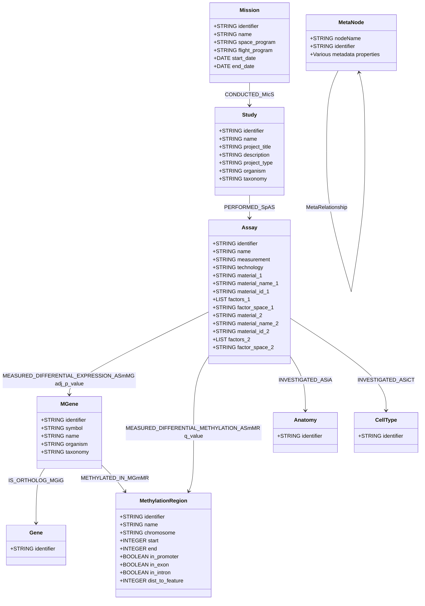

# GeneLab Knowledge Graph Exploration

## Chat Transcript

👤 **User**  
@spoke-genelab

---

🧠 **Assistant**  
I can help you explore the GeneLab knowledge graph! This graph contains data from NASA's GeneLab repository, which includes spaceflight and ground control experiments studying how organisms respond to space environments.

Here are some things I can help you with:

**Exploring the Data:**
- Search for specific genes, studies, or experimental conditions
- Find differentially expressed genes from spaceflight experiments
- Compare gene expression across different conditions or studies

**Visualizations:**
- Create volcano plots showing differential gene expression
- Generate Venn diagrams comparing genes across experiments
- Visualize the knowledge graph schema

**Study Analysis:**
- Select and compare assays from specific studies
- Find common differentially expressed genes across multiple experiments
- Examine relationships between genes, pathways, and experimental factors

Would you like to:
1. Explore a specific study (like OSD-253)?
2. Search for information about particular genes or conditions?
3. See the knowledge graph schema to understand what data is available?
4. Something else?

What would you like to investigate?

---

👤 **User**  
Visualize the schema

---

🧠 **Assistant**  
Here's the GeneLab knowledge graph schema! The diagram shows:

**Core Entity Hierarchy:**
- **Mission** → **Study** → **Assay**: Represents space missions that conduct studies, which perform various assays

**Key Measurement Nodes:**
- **MGene**: Model organism genes with differential expression data
- **MethylationRegion**: DNA methylation regions with differential methylation data
- **Gene**: Reference genes (connected via ortholog relationships)

**Experimental Context:**
- **Anatomy**: Tissue/organ information investigated in assays
- **CellType**: Cell types investigated in assays

**Important Relationships:**
- Assays measure differential expression (with log2fc and adj_p_value)
- Assays measure differential methylation (with methylation_diff and q_value)
- MGenes link to reference Genes through ortholog relationships
- MGenes can have methylation in specific regions

Would you like to explore any specific study or analyze differential gene expression data?

---

👤 **User**  
Create transcript

---

*Created by [mcp-genelab](https://github.com/nasa/mcp-genelab) 0.3.0 using claude-sonnet-4-20250514 on 2025-12-24*
