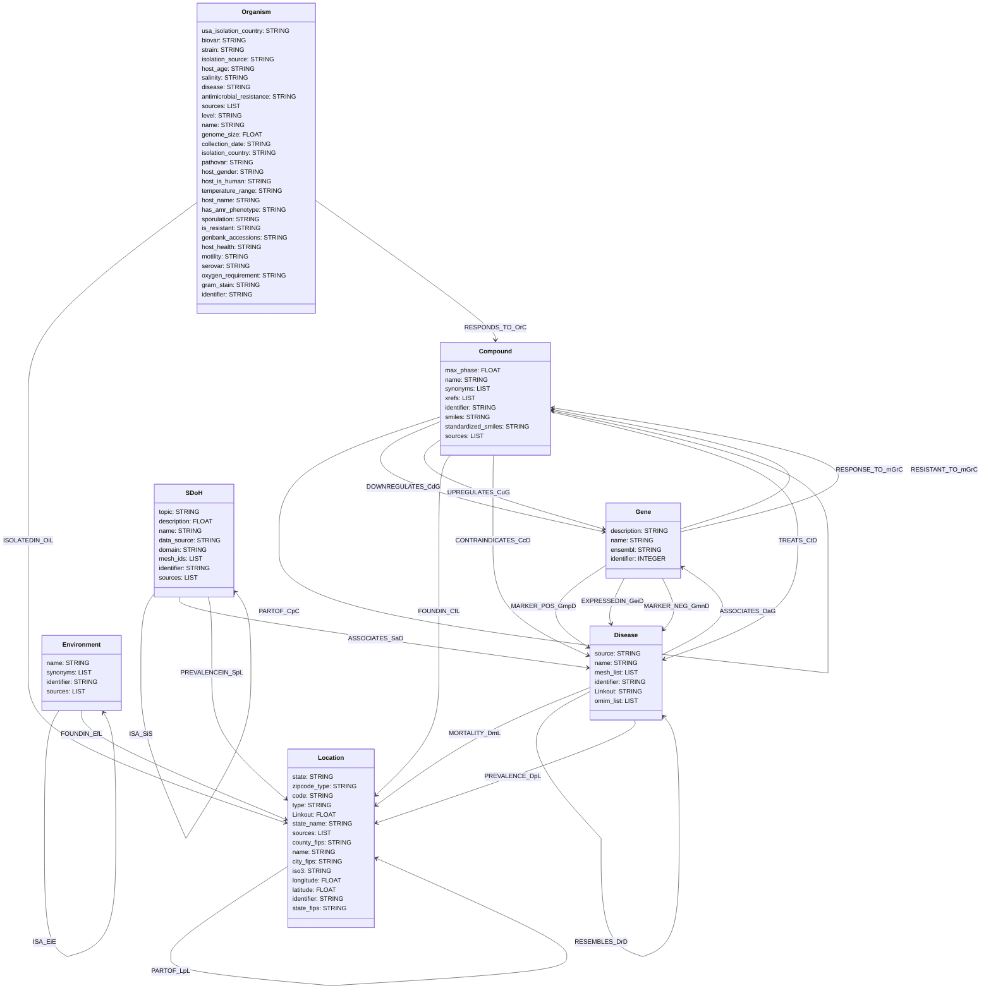

# Chat Transcript: SPOKE Knowledge Graph Schema Visualization

👤 **User**  
@spoke-okn

---

🧠 **Assistant**  
I can see that you've mentioned the SPOKE (Scalable Precision Medicine Oriented Knowledge Engine) MCP server. I have access to various tools for querying this knowledge graph database about biomedical relationships and gene expression data.

What would you like to explore? I can help you with:

- **Schema exploration**: View the structure and types of nodes/relationships in the knowledge graph
- **Gene expression analysis**: Find differentially expressed genes from specific assays
- **Comparative analysis**: Compare gene expression across multiple conditions
- **Visualizations**: Create volcano plots and Venn diagrams for gene expression data
- **Custom queries**: Run specific Cypher queries on the Neo4j database

What biomedical or gene expression questions can I help you investigate?

---

👤 **User**  
Visualize the schema

---

🧠 **Assistant**  
Here's the SPOKE knowledge graph schema visualization:

The schema shows 7 main entity types with their properties and relationships:

**Entities:**
- **Compound**: Chemical compounds with drug information, SMILES structures, and clinical trial phases
- **Disease**: Medical conditions with MESH and OMIM identifiers
- **Gene**: Genetic elements with Ensembl IDs and descriptions
- **Location**: Geographic entities with coordinates and administrative codes
- **Organism**: Biological organisms with detailed microbiological characteristics
- **SDoH** (Social Determinants of Health): Socioeconomic and environmental health factors
- **Environment**: Environmental contexts where organisms or compounds are found

**Key Relationships:**
- Compounds can upregulate/downregulate genes, treat or contraindicate diseases
- Diseases associate with genes and have prevalence/mortality data by location
- Genes serve as disease markers and respond to compounds
- Organisms are isolated in locations and respond to compounds
- SDoH factors associate with diseases and have prevalence in locations

---

👤 **User**  
Create transcript

---

*Created by [mcp-genelab](https://github.com/nasa/mcp-genelab) 0.3.0 using claude-sonnet-4-20250514 on 2024-12-24*
